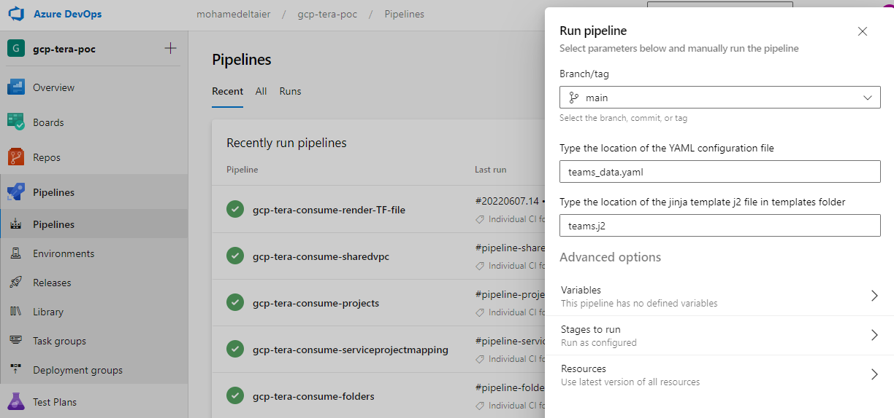
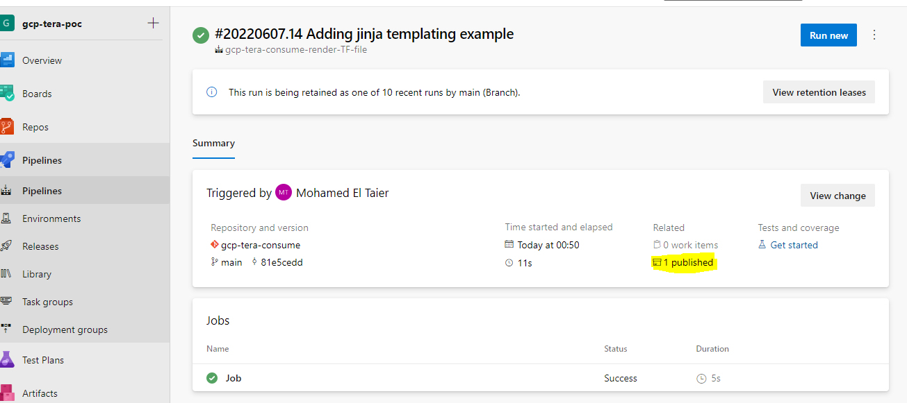
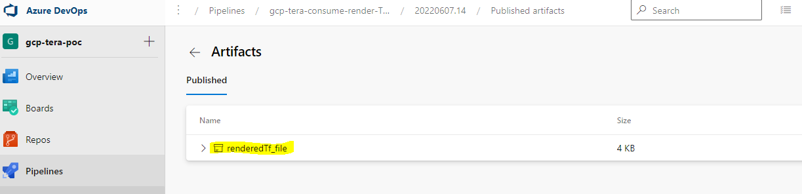

# terraform-cloud-config
# IaC Automation via Jinja2
To automate the deployment of IaC code for complex configurations, consider using Jinja templating.

A sample pipeline is provided in the repo which consists of the following key files

- jinjaTemplates/jinja-render-pipeline.yml -> Pipeline file for running python jinja script.
- jinjaTemplates/teams_data.yaml -> YAML configuration file which contains user parameters defined as strings and objects
- jinjaTemplates/templates/teams.j2 -> jinja2 template file which is used to render the terraform IAC code

The purpose of the pipeline is to run jinja2 against user created .j2 template & YAML config then publish the rendered terraform code as an artifact.

When you attempt to run the pipeline you will be asked to define the location of your YAML configuration as well as the j2 template used to generate terraform code, as below:




After the pipeline runs successfully, the rendered code will be published and can be accessed as below:



Find the published artificat and download it



## EXAMPLE:
### Setting up Pipeline file - YAML
**Example file:** jinjaTemplates/jinja-render-pipeline.yml
The example pipeline file below requires that the user define the YAML configuration file as well as jinja2 template file ".j2".

Once the terrafrom code is rendered, it is then published as an artifact called *renderedTf_file*

```
parameters:
  - name: yamlfile
    displayName: Type the location of the YAML configuration file
    type: string
    default: teams_data.yaml
  - name: jinjafile
    displayName: Type the location of the jinja template j2 file in templates folder
    type: string
    default: team-initial-setup-mixedAccess.j2


pool:
  vmImage: ubuntu-latest


steps:

- script: pwd
  displayName: 'print working directory'

- task: PythonScript@0
  inputs:
    scriptSource: 'filePath'
    scriptPath: 'jinjaTemplates/main.py'
    workingDirectory: jinjaTemplates
    arguments: '${{ parameters.yamlfile }} ${{ parameters.jinjafile }}'

- task: PublishBuildArtifacts@1
  inputs:
    PathtoPublish: 'jinjaTemplates/renderedTf_file.tf'
    ArtifactName: 'renderedTf_file'
    publishLocation: 'Container'
```
-----
### Setting up Configuration file - YAML
**Example file:** jinjaTemplates/teams_data.yaml
The example YAML config below lists variables as strings and objects to be referenced by .j2 template.

```
---
tforg: "meltaier-lab"
teams:
  - name: "teamname01"
    workspaces: 
              - name: wspce_teamname01_APP01_DEV
                tags: ['tag1','tag2','tag3']          
              - name: wspce_teamname01_APP01_PRD
                tags: ['tag5','tag6','tag7']

    SSOId: "InserAADObjectIdHere01"
    variableset: "varset_teamname01"

  - name: "teamnname02"
    SSOId: "InserAADObjectIdHere02"
    variableset: "varset_teamname02"
    workspaces: 
              - name: wspce_teamname02_APP01_DEV
                tags: [tag1,tag2,tag3]          
              - name: wspce_teamname02_APP01_PRD
                tags: [tag5,tag6,tag7]


  - name: "teamnname03"
    SSOId: "InserAADObjectIdHere02"
    variableset: "varset_teamname03"
    workspaces: 
              - name: wspce_teamname03_APP01_DEV
                tags: [tag1,tag2,tag3]          
              - name: wspce_teamname03_APP01_PRD
                tags: [tag5,tag6,tag7]
              - name: wspce_teamname03_APP01_UAT
                tags: [tag5,tag6,tag7]
```
-----
### Setting up jinja2 template - j2
**Example file:** jinjaTemplates/templates/teams.j2
The example j2 template below reads the YAML config file and generates terraform code based on user parameter values defined in YAML config file. Notice the use of nested for loops.

```

#######  - START 
############# Create terraform Cloud team for team: {{team.name}}
resource "tfe_team" "{{team.name}}_plan" {
  name         = "{{team.name}}"
  #sso_team_id  = "{{team.SSOId}}"   ##Optional
  organization = "{{tforg}}"
}
resource "tfe_team" "{{team.name}}_write" {
  name         = "{{team.name}}"
  organization = "{{tforg}}"
}

############# Create terraform Cloud variable set for team: {{team.name}}
resource "tfe_variable_set" "varset_{{team.name}}_write" {
  name          = "varset_{{team.name}}"
  description   = "Variable set for {{team.name}}"
  workspace_ids = [{{team.workspaces | map(attribute='name')|list|makelistofworkspaces }}]
  organization = "{{tforg}}"

}

######################## Create each terraform workspace for team: {{team.name}}
    
resource "tfe_workspace" "{{workspace.name}}" {
  name         = "{{workspace.name}}"
  tag_names    = {{ '['+'\"' + workspace.tags | join('\", \"') + '\"' +']' }}
  organization = "{{tforg}}"

  }
  

######################## Enforce plan and write access for each workspace
  
resource "tfe_team_access" "{{team.name}}_{{workspace.name}}_plan_access" {
  access       = "plan"
  team_id      = tfe_team.{{team.name}}.id
  workspace_id = tfe_workspace.{{workspace.name}}.id
}
resource "tfe_team_access" "{{team.name}}_{{workspace.name}}_write_access" {
  access       = "write"
  team_id      = tfe_team.{{team.name}}_write.id
  workspace_id = tfe_workspace.{{workspace.name}}_write.id
}
  
######################################################################### - END


terraform {
  cloud {
    organization = "meltaier-lab"

    workspaces {
      name = "test"
    }
  }
}

```

### Rendered Terraform file

```
#######  - START 
############# Create terraform Cloud team for team: teamname01
resource "tfe_team" "teamname01_plan" {
  name         = "teamname01"
  #sso_team_id  = "InserAADObjectIdHere01"   ##Optional
  organization = "meltaier-lab"
}
resource "tfe_team" "teamname01_write" {
  name         = "teamname01"
  organization = "meltaier-lab"
}

############# Create terraform Cloud variable set for team: teamname01
resource "tfe_variable_set" "varset_teamname01_write" {
  name          = "varset_teamname01"
  description   = "Variable set for teamname01"
  workspace_ids = [tfe_workspace.wspce_teamname01_APP01_DEV.id,tfe_workspace.wspce_teamname01_APP01_PRD.id]
  organization = "meltaier-lab"

}

######################## Create each terraform workspace for team: teamname01
    
resource "tfe_workspace" "wspce_teamname01_APP01_DEV" {
  name         = "wspce_teamname01_APP01_DEV"
  tag_names    = ["tag1", "tag2", "tag3"]
  organization = "meltaier-lab"

  }
    
resource "tfe_workspace" "wspce_teamname01_APP01_PRD" {
  name         = "wspce_teamname01_APP01_PRD"
  tag_names    = ["tag5", "tag6", "tag7"]
  organization = "meltaier-lab"

  }
  

######################## Enforce plan and write access for each workspace
  
resource "tfe_team_access" "teamname01_wspce_teamname01_APP01_DEV_plan_access" {
  access       = "plan"
  team_id      = tfe_team.teamname01.id
  workspace_id = tfe_workspace.wspce_teamname01_APP01_DEV.id
}
resource "tfe_team_access" "teamname01_wspce_teamname01_APP01_DEV_write_access" {
  access       = "write"
  team_id      = tfe_team.teamname01_write.id
  workspace_id = tfe_workspace.wspce_teamname01_APP01_DEV_write.id
}
  
resource "tfe_team_access" "teamname01_wspce_teamname01_APP01_PRD_plan_access" {
  access       = "plan"
  team_id      = tfe_team.teamname01.id
  workspace_id = tfe_workspace.wspce_teamname01_APP01_PRD.id
}
resource "tfe_team_access" "teamname01_wspce_teamname01_APP01_PRD_write_access" {
  access       = "write"
  team_id      = tfe_team.teamname01_write.id
  workspace_id = tfe_workspace.wspce_teamname01_APP01_PRD_write.id
}
  
######################################################################### - END

#######  - START 
############# Create terraform Cloud team for team: teamnname02
resource "tfe_team" "teamnname02_plan" {
  name         = "teamnname02"
  #sso_team_id  = "InserAADObjectIdHere02"   ##Optional
  organization = "meltaier-lab"
}
resource "tfe_team" "teamnname02_write" {
  name         = "teamnname02"
  organization = "meltaier-lab"
}

############# Create terraform Cloud variable set for team: teamnname02
resource "tfe_variable_set" "varset_teamnname02_write" {
  name          = "varset_teamnname02"
  description   = "Variable set for teamnname02"
  workspace_ids = [tfe_workspace.wspce_teamname02_APP01_DEV.id,tfe_workspace.wspce_teamname02_APP01_PRD.id]
  organization = "meltaier-lab"

}

######################## Create each terraform workspace for team: teamnname02
    
resource "tfe_workspace" "wspce_teamname02_APP01_DEV" {
  name         = "wspce_teamname02_APP01_DEV"
  tag_names    = ["tag1", "tag2", "tag3"]
  organization = "meltaier-lab"

  }
    
resource "tfe_workspace" "wspce_teamname02_APP01_PRD" {
  name         = "wspce_teamname02_APP01_PRD"
  tag_names    = ["tag5", "tag6", "tag7"]
  organization = "meltaier-lab"

  }
  

######################## Enforce plan and write access for each workspace
  
resource "tfe_team_access" "teamnname02_wspce_teamname02_APP01_DEV_plan_access" {
  access       = "plan"
  team_id      = tfe_team.teamnname02.id
  workspace_id = tfe_workspace.wspce_teamname02_APP01_DEV.id
}
resource "tfe_team_access" "teamnname02_wspce_teamname02_APP01_DEV_write_access" {
  access       = "write"
  team_id      = tfe_team.teamnname02_write.id
  workspace_id = tfe_workspace.wspce_teamname02_APP01_DEV_write.id
}
  
resource "tfe_team_access" "teamnname02_wspce_teamname02_APP01_PRD_plan_access" {
  access       = "plan"
  team_id      = tfe_team.teamnname02.id
  workspace_id = tfe_workspace.wspce_teamname02_APP01_PRD.id
}
resource "tfe_team_access" "teamnname02_wspce_teamname02_APP01_PRD_write_access" {
  access       = "write"
  team_id      = tfe_team.teamnname02_write.id
  workspace_id = tfe_workspace.wspce_teamname02_APP01_PRD_write.id
}
  
######################################################################### - END

#######  - START 
############# Create terraform Cloud team for team: teamnname03
resource "tfe_team" "teamnname03_plan" {
  name         = "teamnname03"
  #sso_team_id  = "InserAADObjectIdHere02"   ##Optional
  organization = "meltaier-lab"
}
resource "tfe_team" "teamnname03_write" {
  name         = "teamnname03"
  organization = "meltaier-lab"
}

############# Create terraform Cloud variable set for team: teamnname03
resource "tfe_variable_set" "varset_teamnname03_write" {
  name          = "varset_teamnname03"
  description   = "Variable set for teamnname03"
  workspace_ids = [tfe_workspace.wspce_teamname03_APP01_DEV.id,tfe_workspace.wspce_teamname03_APP01_PRD.id,tfe_workspace.wspce_teamname03_APP01_UAT.id]
  organization = "meltaier-lab"

}

######################## Create each terraform workspace for team: teamnname03
    
resource "tfe_workspace" "wspce_teamname03_APP01_DEV" {
  name         = "wspce_teamname03_APP01_DEV"
  tag_names    = ["tag1", "tag2", "tag3"]
  organization = "meltaier-lab"

  }
    
resource "tfe_workspace" "wspce_teamname03_APP01_PRD" {
  name         = "wspce_teamname03_APP01_PRD"
  tag_names    = ["tag5", "tag6", "tag7"]
  organization = "meltaier-lab"

  }
    
resource "tfe_workspace" "wspce_teamname03_APP01_UAT" {
  name         = "wspce_teamname03_APP01_UAT"
  tag_names    = ["tag5", "tag6", "tag7"]
  organization = "meltaier-lab"

  }
  

######################## Enforce plan and write access for each workspace
  
resource "tfe_team_access" "teamnname03_wspce_teamname03_APP01_DEV_plan_access" {
  access       = "plan"
  team_id      = tfe_team.teamnname03.id
  workspace_id = tfe_workspace.wspce_teamname03_APP01_DEV.id
}
resource "tfe_team_access" "teamnname03_wspce_teamname03_APP01_DEV_write_access" {
  access       = "write"
  team_id      = tfe_team.teamnname03_write.id
  workspace_id = tfe_workspace.wspce_teamname03_APP01_DEV_write.id
}
  
resource "tfe_team_access" "teamnname03_wspce_teamname03_APP01_PRD_plan_access" {
  access       = "plan"
  team_id      = tfe_team.teamnname03.id
  workspace_id = tfe_workspace.wspce_teamname03_APP01_PRD.id
}
resource "tfe_team_access" "teamnname03_wspce_teamname03_APP01_PRD_write_access" {
  access       = "write"
  team_id      = tfe_team.teamnname03_write.id
  workspace_id = tfe_workspace.wspce_teamname03_APP01_PRD_write.id
}
  
resource "tfe_team_access" "teamnname03_wspce_teamname03_APP01_UAT_plan_access" {
  access       = "plan"
  team_id      = tfe_team.teamnname03.id
  workspace_id = tfe_workspace.wspce_teamname03_APP01_UAT.id
}
resource "tfe_team_access" "teamnname03_wspce_teamname03_APP01_UAT_write_access" {
  access       = "write"
  team_id      = tfe_team.teamnname03_write.id
  workspace_id = tfe_workspace.wspce_teamname03_APP01_UAT_write.id
}
  
######################################################################### - END


terraform {
  cloud {
    organization = "meltaier-lab"

    workspaces {
      name = "test"
    }
  }
}


```
###
# Author

## **Mohamed El Taier - NTT Pty Ltd**
### Principal Cloud Engineer
### Release date: 28/05/2022
### **Contact:** mohamed.eltaier@global.ntt

